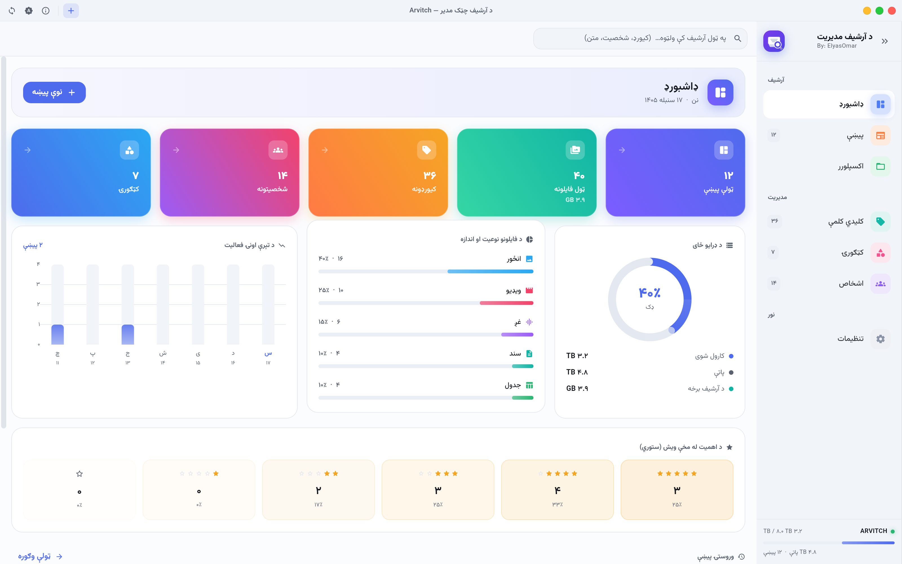
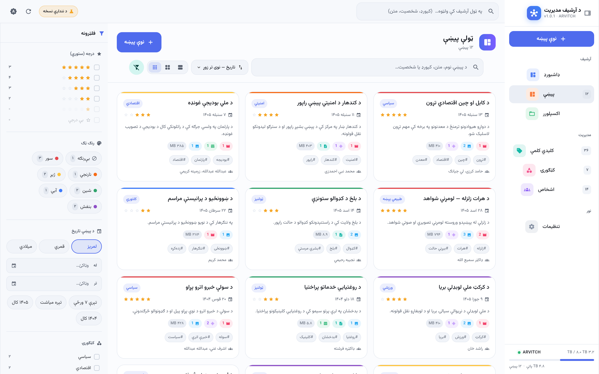
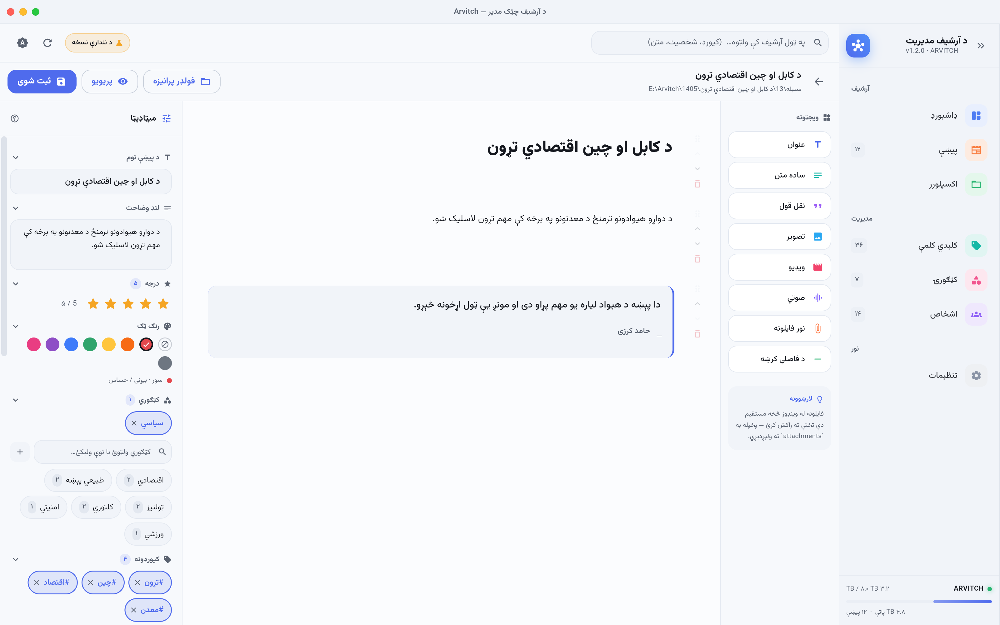
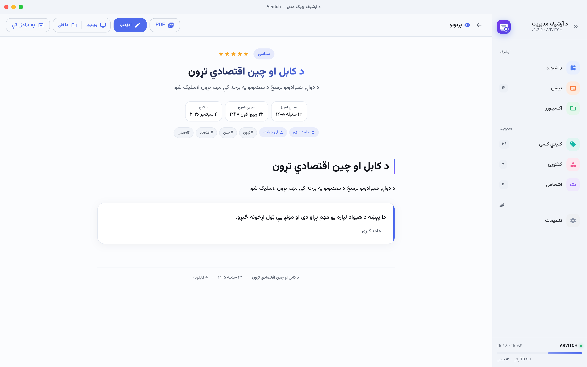
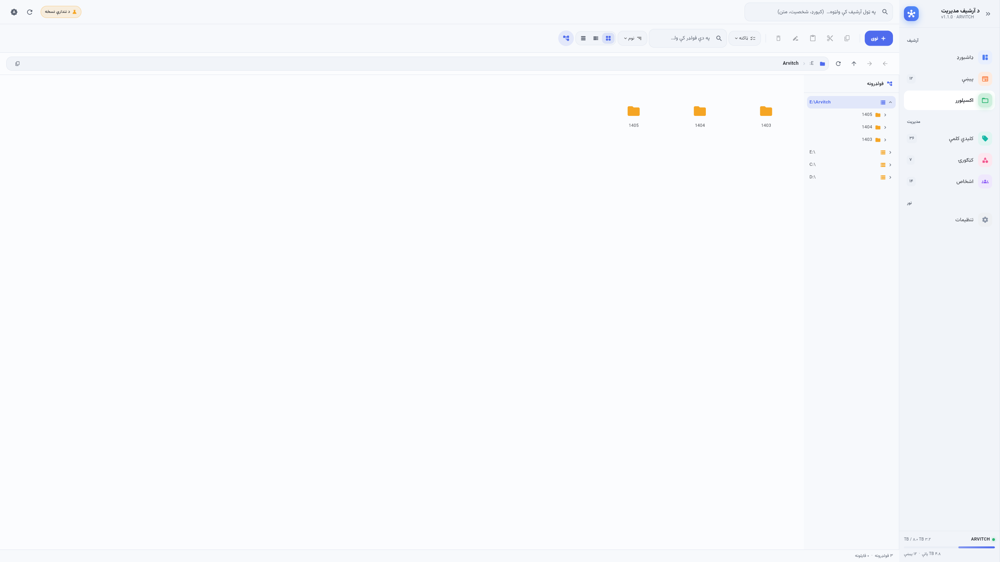
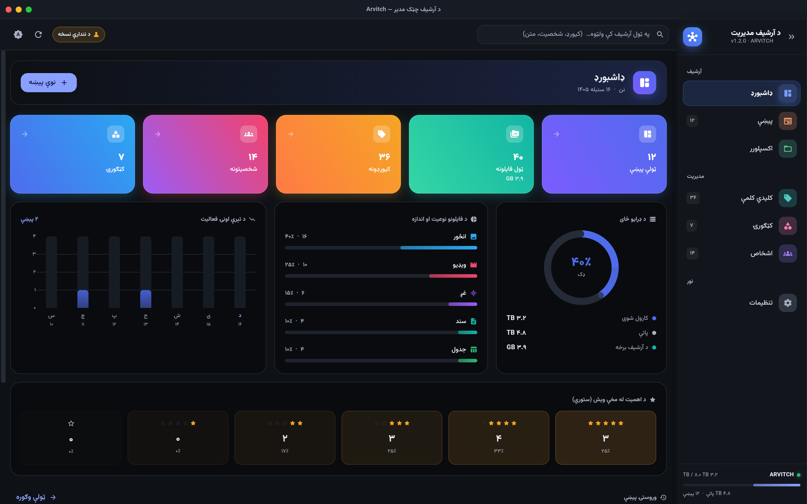
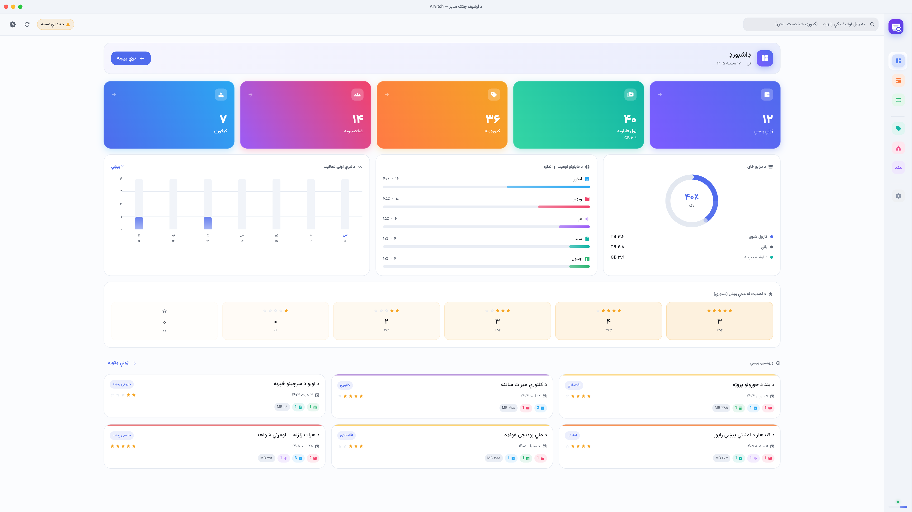
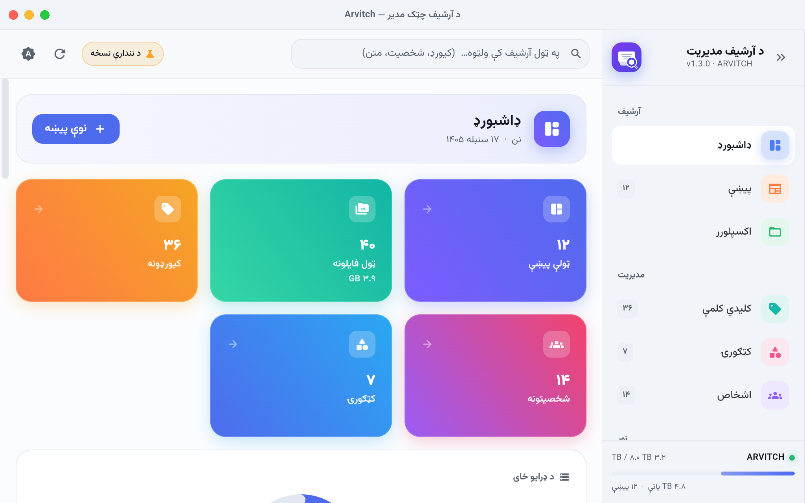
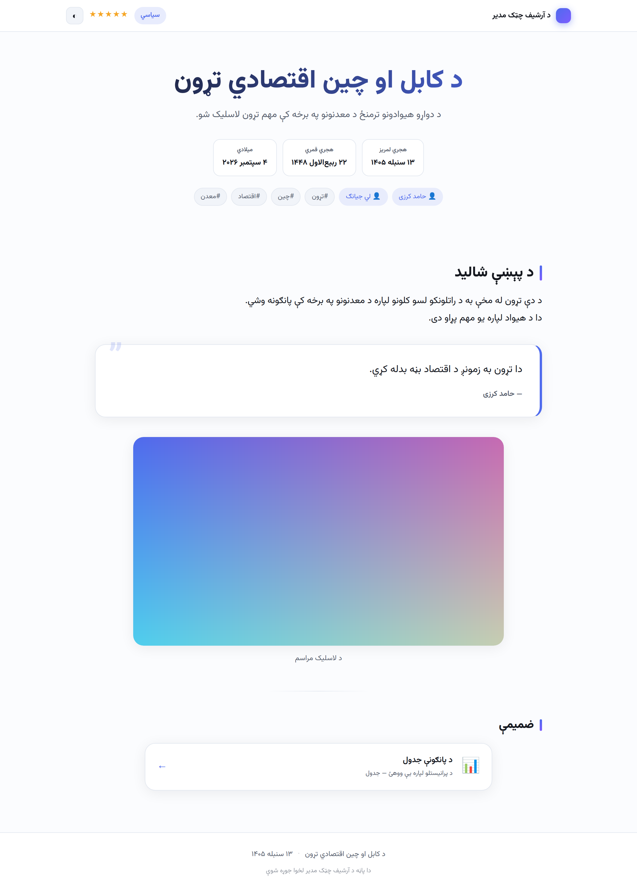
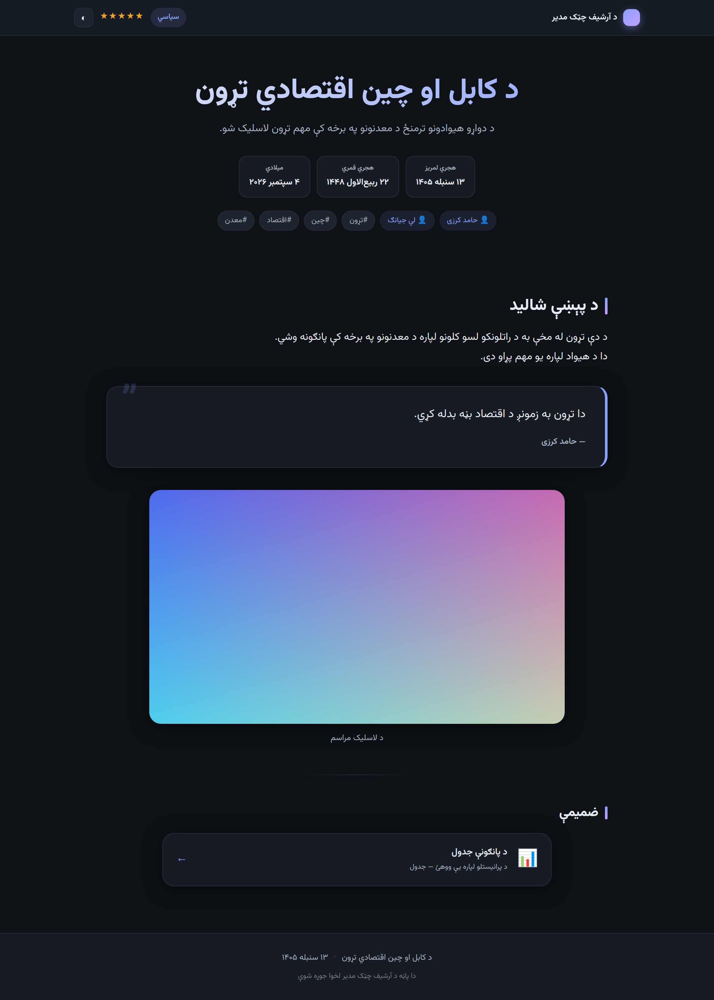

<div align="right">

# د آرشیف چټک مدیر

**هغه څه چې پخوا یې موندلو ساعتونه — آن دوې ورځې — وخت نیوه، اوس یې په څو ثانیو کې مومئ.**

د رسنیزو شواهدو (ویډیو، انځور، غږ، نقل قول، لینک) د آرشیف مدیریت لپاره یو
ډیسکټاپ پروګرام — چې د څو ټیرابایټو ډیټا دننه لټون په میلي‌ثانیو کې کوي.

</div>

---

## 📸 انځورونه

| ډاشبورډ | پیښې او فلټرونه |
|---|---|
|  |  |

| د پاڼې جوړونکی | پریویو |
|---|---|
|  |  |

| فایل اکسپلورر | تیاره تیم |
|---|---|
|  |  |

**سایډبار — پراخ او ټول شوی حالت** (نرم انتقال):

| پراخ | ټول شوی |
|---|---|
|  |  |

**په کوچنیو سکرینونو کې** — سایډبار پخپله راټولیږي، فلټر پینل تڼۍ ته
اوړي، وسیلې ښکته کرښې ته ځي. هیڅ برخه بهر نه لویږي:

| ۱۰۲۴×۶۴۰ | ۹۰۰×۶۰۰ |
|---|---|
|  |  |

**جوړه شوې `index.html` پاڼه** (په براوزر کې، پرته له انټرنیټه):

| سپین | تیاره |
|---|---|
|  |  |

> نورې پاڼې د [`docs/screenshots/`](docs/screenshots/) فولډر کې دي.

---

## 🧪 د ازموینې نمونه آرشیف

پروګرام پرته له خپلې ډیټا وازمویئ — یو چمتو فرضي آرشیف:

### 📦 [`docs/sample/Arvitch-Sample-Archive.zip`](docs/sample/Arvitch-Sample-Archive.zip) · ۲۳ MB

| | |
|---|---|
| پیښې | **۳,۰۰۰** |
| ضمیمې | **۷,۴۵۵** (ریښتیني انځور، ویډیو، غږ، PDF، CSV) |
| ټول فایلونه | **۱۰,۷۵۵** |
| کلونه | ۱۳۹۶ — ۱۴۰۵ (هجري لمریز) |
| کیورډونه · اشخاص · کټګورۍ | ۲۶ · ۱۲ · ۹ |

**څنګه؟** ZIP راوباسئ → پروګرام وچلوئ → همدا فولډر د آرشیف په توګه
وټاکئ. سکن ~۱ ثانیه نیسي، بیا ولټوئ.

هره ضمیمه یو **ریښتینی** فایل دی (نه تش نوم) — نو ټامنیلونه، پریویو
او «په بل پروګرام کې پرانیزه» ټول کار کوي. فایلونه قصداً کوچني دي
(۱–۴ KB) ترڅو ډانلوډ سپک وي.

> بیا یې جوړول یا د بلې کچې لپاره: [`tool/README.md`](tool/README.md)

---

## ⚡ ولې چټک دی

**بنسټیز اصل: مونږ د لټون پر مهال ډیسک نه سکن کوو.**

د لټون ساحه فایلونه نه دي — **میټاډیټا** ده. هره پیښه یو کوچنی
`metadata.json` لري، نو:

```
۱۰,۰۰۰ پیښې × ~۲KB میټاډیټا = ~۲۰MB  →  ټول په RAM کې ځای نیسي
```

له همدې امله د لټون وخت د ډرایو له لویوالي سره **هیڅ اړیکه نه لري** —
یوازې د پیښو له شمېر سره.

### ریښتینې اندازه‌ګیري — پر ریښتیني ډیسک

دا د یادښت دننه نمونه نه ده. په ازموینه کې **په ریښتیا سره پر ډیسک**
زرګونه د پیښو فولډرونه او `metadata.json` فایلونه جوړیږي، بیا سکن
کیږي، بیا پرې پلټنه کیږي — دقیقاً هغه لار چې پروګرام یې کاروي.
(`test/real_scale_test.dart`)

|  | ۵,۰۰۰ پیښې | ۵۰,۰۰۰ پیښې |
|---|---|---|
| د محتوا کچه چې استازیتوب کوي | ~۳٫۴ TB | ~۳۵ TB |
| د میټاډیټا حجم پر ډیسک | ۴۰ MB | ۴۰۵ MB |
| د ایندکس فایل | ۱۷ MB | ۱۷۲ MB |
| **بشپړ سکن** (یو ځل) | **۰٫۴۵ s** | **۳٫۱ s** |
| **ایندکس جوړول** (یو ځل) | **۰٫۷ s** | **۷٫۵ s** |

**پلټنه — هر ځل چې کاروونکی لټوي:**

| پلټنه | ۵,۰۰۰ | ۵۰,۰۰۰ |
|---|---|---|
| بشپړ متن «زلزله» | ۵٫۸ ms | ۹٫۸ ms |
| لومړي حروف «پارلم» | ۶٫۴ ms | ۱۰٫۵ ms |
| درجه + رنګ | ۴٫۸ ms | ۷٫۷ ms |
| کټګوري + کیورډ | ۴٫۶ ms | ۹٫۳ ms |
| شخصیت | ۵٫۷ ms | ۱۸٫۱ ms |
| نېټه (شمسي/قمري) | ۳٫۸ ms | ۳٫۵ ms |
| ټول فلټرونه یوځای | ۵٫۷ ms | ۳۰٫۴ ms |
| ټولې فاسیټ شمېرې | ۵٫۰ ms | ۵۲٫۸ ms |
| **تر ټولو ورو** | **۷٫۵ ms** | **۵۲٫۸ ms** |

> ۵۳ میلي‌ثانیې = د سترګو له رپ څخه ~۶ ځله چټک.
> پخوا همدا کار **ساعتونه** نیول.

**ولې د ډرایو لویوالی اهمیت نه لري:** د نېټې پلټنه په ۵۰,۰۰۰ پیښو کې
هماغومره چټکه ده لکه په ۵,۰۰۰ کې (۳٫۵ms در مقابل ۳٫۸ms) — ځکه چې
`jdn` یو ایندکس شوی عدد دی، نو SQLite یوازې د B-tree څو پوړه ښکته
ځي، نه چې ټول ریکارډونه ولولي.

---

## 🗂 دوه‌پوړیزه ذخیره

### پوړ ۱ — حقیقت پر ډیسک

```
📁 د کابل او چین تړون/
├── 📄 index.html          ← ښکلې، خپلواکه پاڼه (هر براوزر یې پرانیزي)
├── 📄 metadata.json       ← د چټک فلټر لپاره خام ډېټا
└── 📁 attachments/
    ├── 🎥 doc_video_01.mp4
    ├── 🖼️ evidence_img_01.jpg
    └── 🎙️ statement_audio.wav
```

- **د لېږد وړ** — هارډ بل کمپیوټر ته یوسئ، هر څه ورسره دي
- **د انسان لوستلو وړ** — که سافټویر هم ورک شي، ډیټا نه ورکیږي
- **`index.html` خپلواک دی** — CSS/JS دننه دي، انټرنیټ ته اړتیا نشته
- **فونټ یو ځل ساتل کیږي** — `_arvitch/fonts/` کې، نو زرګونه پاڼې
  یوازې یو ځل ~۲۰۰KB نیسي او هره یوه یې د نسبي مسیر له لارې راولي

### پوړ ۲ — مشتق ایندکس

په `AppData` کې یو `index.db` (SQLite + FTS5). کاروونکی یې هیڅکله نه ویني.
که ورک شي، یو بیا سکن یې بشپړ جوړوي.

---

## 🎯 ځانګړنې

### د Adobe Bridge په کچه فلټرونه
د Bridge د **Filter Panel** ټول معیارونه — د **ژوندیو شمېرو** سره،
د ډلو ترمنځ **AND** او د یوې ډلې دننه **OR**:

⭐ درجه (۰–۵) · 🎨 ۹ رنګه ټګ · 🏷 کیورډونه · 👤 شخصیتونه ·
📂 کټګورۍ · 🎬 د فایل ډول · 📅 د نېټې سلسله (درې واړه تقویمونه)

### درې تقویمونه، یو ځل ثبت
هر تاریخ په **هجري لمریز**، **هجري قمري** او **میلادي** کې ساتل کیږي،
او یو **Julian Day Number** ورسره — نو د هر تقویم پلټنه یوازې یوه
عددي پرتله ده.

```json
"date": {
  "jdn": 2461288,
  "shamsi": { "y": 1405, "m": 6, "d": 13, "text": "۱۳ سنبله ۱۴۰۵" },
  "qamari": { "y": 1448, "m": 3, "d": 22, "text": "۲۲ ربیع‌الاول ۱۴۴۸" },
  "miladi": { "y": 2026, "m": 9, "d": 4,  "text": "۴ سپتمبر ۲۰۲۶" }
}
```

### د پاڼې ډراګ-او-ډراپ جوړونکی
۸ ویجټونه — عنوان · ساده متن · نقل قول · تصویر · ویډیو · صوتي ·
نور فایلونه · د فاصلې کرښه. فایلونه له وینډوز څخه مستقیم راکش کړئ —
پخپله `attachments/` ته لېږدیږي.

### د اتومات فولډر جوړونه
```
E:\Arvitch\1405\سنبله\13\د کابل او چین تړون\
         └─کال─┘└─میاشت─┘└ورځ┘└──د پیښې نوم──┘
```

### داخلي فایل اکسپلورر
د فولډرونو ونه · ۳ لیدونه · ترتیب · کاپي/کټ/پیسټ · مولټي‌سیلکټ
(Ctrl/Shift) · د یو ډول ټول فایلونه ټاکل · د راسته کلیک مینو ·
د کیبورډ لنډې لارې

---

## 🏗 تخنیکي جوړښت

**بشپړ Dart/Flutter — پایتون نه کارول کیږي.**

| ولې؟ | |
|---|---|
| **یو `.exe`** | هیڅ اضافي runtime بنډل کولو ته اړتیا نشته |
| **`dart:ffi` → SQLite** | د لټون درنه برخه په C کوډ کې ترسره کیږي |
| **`Isolate`** | د ۵TB ډرایو سکن هم UI نه ځنډوي |

بشپړ وضاحت: [`docs/ARCHITECTURE.md`](docs/ARCHITECTURE.md)

### د کوډ جوړښت
```
lib/
├── core/       تیم، ژبه، د تاریخ ماشین
├── data/
│   ├── models/     ماډلونه + د لټون پوښتنه
│   ├── platform/   د فایل سیسټم لایه (io / demo)
│   ├── index/      SQLite FTS5 + د یادښت بدیل
│   └── repository/ AppState
├── features/   هره پاڼه یو فولډر
└── widgets/    ګډ UI اجزا
```

---

## 🚀 جوړول او چلول

### له سرچینې
```bash
flutter pub get
flutter run -d windows      # یا linux
```

### وینډوز خروجي
```bash
flutter build windows --release
```

یا په GitHub کې د **«د وینډوز خروجي جوړول»** ورک‌فلو وچلوئ — پخپله
یو `.tar.xz` جوړوي چې په `xz -9 --extreme` سره فوق‌العاده کمپرس شوی وي.

### ازموینې
```bash
flutter test        # ۳۲ ازموینې
flutter analyze     # پاک
```

---

## ✅ ازموینې

| ډله | څه ازمویي |
|---|---|
| `date_test` | د دریو تقویمونو بدلون او د JDN دوه‌لوري روغتیا |
| `index_test` | FTS5 پښتو لټون، فاسیټونه، ترتیب، د زرق‌کولو خونديتوب |
| `parity_test` | SQL او د یادښت ماشینونه **باید یو شان پایلې** ورکړي |
| `html_test` | خپلواکه پاڼه + د HTML د زرق‌کولو مخنیوی |
| `io_backend_test` | ریښتینی فایل سیسټم: فولډر، JSON، بیا سکن |
| `smoke_test` | هره پاڼه په دواړو تیمونو کې پرته له تېروتنې جوړیږي |
| `bench_test` | د ۲۰,۰۰۰ پیښو کارکردګي |

---

## 📄 جواز

فونټ: [وزیر متن](https://github.com/rastikerdar/vazirmatn) (SIL OFL 1.1)
